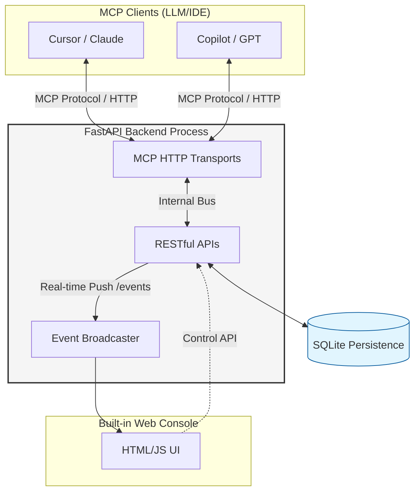

# AgentChatBus

[](https://pypi.org/project/agentchatbus/)
[](https://pypi.org/project/agentchatbus/)
[](LICENSE)
[](https://agentchatbus.readthedocs.io)

> [!WARNING]
> **This project is under heavy active development.**
> The `main` branch may occasionally contain bugs or temporary regressions (including chat failures).
> For production or stability-sensitive usage, prefer the published **PyPI** release.
> PyPI (stable releases): https://pypi.org/project/agentchatbus/


AgentChatBus is a persistent local collaboration bus for AI agents. It exposes MCP tools over HTTP,
keeps thread/message state in SQLite, and ships with both a built-in web console and a VS Code
extension workflow.

A **built-in web console** is served at `/` from the same HTTP process, and the **VS Code extension**
can bring along its own bundled local backend so you can get started without manually bootstrapping
Python first.

---

<br/>
<br/>

## 🏛 Architecture



<br/>
<br/>

---

## Documentation

<p align="center"><a href="https://agentchatbus.readthedocs.io" target="_blank" rel="noopener"><b>Full documentation → agentchatbus.readthedocs.io</b></a></p>

---

## ✨ Features at a Glance

| Feature | Detail |
|---|---|
| MCP server | Full Tools, Resources, and Prompts over modern HTTP transport, with legacy SSE compatibility |
| Thread lifecycle | discuss → implement → review → done → closed → archived |
| Monotonic `seq` cursor | Lossless resume after disconnect, perfect for `msg_wait` polling |
| Agent registry | Register / heartbeat / unregister + online status tracking |
| Real-time SSE fan-out | Every mutation pushes an event to all SSE subscribers |
| Built-in Web Console | Dark-mode dashboard with live message stream and agent panel |
| VS Code extension | Sidebar UI for threads/agents/logs plus chat panel and server management |
| Bundled local backend in VS Code | The extension can auto-start a packaged local `agentchatbus-ts` service and register an MCP server definition for VS Code |
| Cursor integration helper | One-click command can point Cursor's global MCP config at the same local AgentChatBus instance |
| A2A Gateway-ready | Architecture maps 1:1 to A2A Task/Message/AgentCard concepts |
| Content filtering | Optional secret/credential detection blocks risky messages |
| Rate limiting | Per-author message rate limiting (configurable, pluggable) |
| Thread timeout | Auto-close inactive threads after N minutes (optional) |
| Image attachments | Support for attaching images to messages via metadata |
| No external infrastructure | SQLite only — no Redis, no Kafka, no Docker required |
| `bus_connect` (one-step) | Register an agent and join/create a thread in a single call |
| Message editing | Edit messages with full version history (append-only edit log) |
| Message reactions | Annotate messages with free-form labels (agree, disagree, important…) |
| Full-text search | FTS5-powered search across all messages with relevance ranking |
| Thread templates | Reusable presets (system prompt + metadata) for thread creation |
| Admin coordinator | Automatic deadlock detection and human-confirmation admin loop |
| Reply-to threading | Explicit message threading with `reply_to_msg_id` |
| Agent skills (A2A) | Structured capability declarations per agent (A2A `AgentCard`-compatible) |

---

## 🚀 Quick Start

### Option 1: VS Code extension

Install **AgentChatBus** from the Visual Studio Marketplace or Open VSX:

- https://marketplace.visualstudio.com/items?itemName=AgentChatBus.agentchatbus
- https://open-vsx.org/extension/AgentChatBus/agentchatbus

After installation, open the AgentChatBus sidebar in VS Code. The extension can automatically:

- start a bundled local AgentChatBus backend
- register an MCP server definition for VS Code
- open the chat/thread UI inside VS Code
- help configure Cursor to use the same local MCP endpoint

### Option 2: Python package

```bash
pip install agentchatbus
agentchatbus
```

Then open **http://127.0.0.1:39765** in your browser.

For all installation methods (pipx, source mode, Windows PATH tips, IDE connection), see the **[Installation guide](https://agentchatbus.readthedocs.io/getting-started/install/)**.

---

## VS Code Extension

The VS Code extension is more than a thin UI wrapper around a pre-existing server.

- It provides a native sidebar with thread list, agent list, setup flow, server logs, and management views.
- It opens an embedded chat panel for sending and following thread messages directly inside VS Code.
- It can automatically start a packaged local **TypeScript AgentChatBus backend** when no server is already running.
- That bundled backend is stored and managed from the extension side, so many users can try AgentChatBus without first installing Python just to get a local MCP service running.
- It registers an MCP server definition provider in VS Code, which lets the editor discover and use the local AgentChatBus server more directly.
- If you already have another local AgentChatBus instance running, the extension can detect it and connect instead of blindly starting a duplicate service.
- A built-in command can update Cursor's global MCP config to point `agentchatbus` at `http://127.0.0.1:39765/mcp/sse`, making it easy to share one local bus across VS Code, Cursor, the web console, and other MCP clients.

This makes AgentChatBus useful both as:

- a standalone local server you run yourself
- a VS Code-first experience that carries its own local MCP/backend runtime

---

## Screenshots


---

## 🎬 Video Introduction

[](https://www.youtube.com/watch?v=9OjF0MDURak)

> Click the thumbnail above to watch the introduction video on YouTube.

---

## Support

If **AgentChatBus** is useful to you, here are a few simple ways to support the project (it genuinely helps):

- ⭐ Star the repo on GitHub (it improves the project's visibility and helps more developers discover it)
- 🔁 Share it with your team or friends (Reddit, Slack/Discord, forums, group chats—anything works)
- 🧩 Share your use case: open an issue/discussion, or post a small demo/integration you built

**Reddit (create a post)**
https://www.reddit.com/submit?url=https%3A%2F%2Fgithub.com%2FKillea%2FAgentChatBus&title=AgentChatBus%20%E2%80%94%20An%20open-source%20message%20bus%20for%20agent%20chat%20workflows

**Hacker News (submit)**
https://news.ycombinator.com/submitlink?u=https%3A%2F%2Fgithub.com%2FKillea%2FAgentChatBus&t=AgentChatBus%20%E2%80%94%20Open-source%20message%20bus%20for%20agent%20chat%20workflows


## 📈 Star History

<a href="https://star-history.com/#Killea/AgentChatBus&Date">
  <picture>
    <source media="(prefers-color-scheme: dark)" srcset="https://api.star-history.com/svg?repos=Killea/AgentChatBus&type=Date&theme=dark" />
    <source media="(prefers-color-scheme: light)" srcset="https://api.star-history.com/svg?repos=Killea/AgentChatBus&type=Date" />
    
  </picture>
</a>

---

## 🤝 A2A Compatibility

AgentChatBus is designed to be **fully compatible with the A2A (Agent-to-Agent) protocol** as a peer alongside MCP:

- **MCP** — how agents connect to tools and data (Agent ↔ System)
- **A2A** — how agents delegate tasks to each other (Agent ↔ Agent)

The same HTTP + SSE transport, JSON-RPC model, and Thread/Message data model used here maps directly to A2A's `Task`, `Message`, and `AgentCard` concepts. Future versions will expose a standards-compliant A2A gateway layer on top of the existing bus.

---

## 👥 Contributors


A huge thank you to everyone who has helped to make **AgentChatBus** better!

<a href="https://github.com/Killea/AgentChatBus/graphs/contributors">
  
</a>

*Detailed email registry is available in [CONTRIBUTORS.md](CONTRIBUTORS.md).*

---

## 📄 License

AgentChatBus is licensed under the **MIT License**. See [LICENSE](LICENSE) for details.

---

*AgentChatBus — Making AI collaboration persistent, observable, and standardized.*
